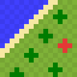

# Simple World Map

A small client-side world map mod for Fabric.

It records the terrain you explore and shows it on a fullscreen map with waypoints. It works in single player and on vanilla servers.

## Features

- Fullscreen map of explored terrain, with grass, leaves and water colored by biome
- Zoom from block level out to thousands of blocks across
- Custom waypoints with a name and color
- A waypoint where you last died
- Player heads for you and nearby players

## Controls

| Input | Action |
| --- | --- |
| `M` | Open or close the map |
| Scroll wheel, `+` / `-` | Zoom in or out |
| Right-click on the map | Add a waypoint there |
| Right-click on a waypoint | Edit or delete it |
| `Space` | Center the map on yourself |

`M`, `+` and `-` can be rebound.

## Downloads

Download the latest jar from [GitHub Releases](https://github.com/riccardopll/simple-worldmap/releases).

## Installation

1. Install [Fabric](https://fabricmc.net/use/) and the [Fabric API](https://modrinth.com/mod/fabric-api).
2. Put [Fabric API](https://modrinth.com/mod/fabric-api) in your `mods` folder.
3. Put `simple-worldmap-<version>.jar` in your `mods` folder.

## Storage

Map data is stored in `.minecraft/simple-worldmap/`, separate from world saves. To reset the map for a world, delete its folder while the game is closed.

## Reporting issues

Report bugs and feature requests on the [issue tracker](https://github.com/riccardopll/simple-worldmap/issues).
